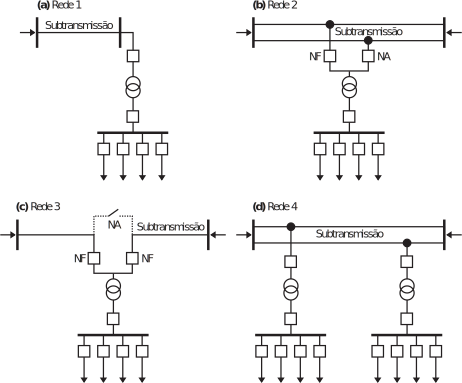
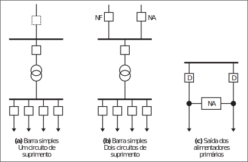
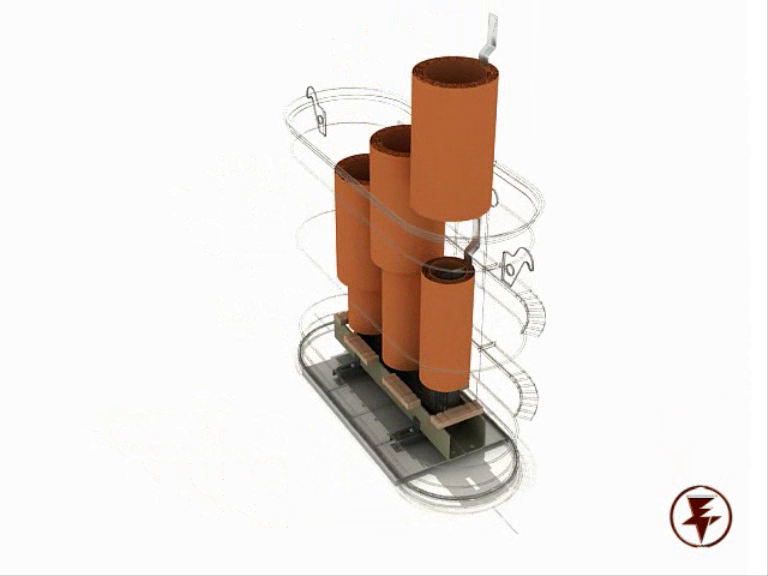

% Distribuição de Energia Elétrica
% Aula 01: Introdução
% Professor Lucas Melo - Abril de 2017

# <!-- Comment -->

## Sistema Elétrico de Potência
- **Geração**: Perfaz a função de converter alguma forma de energia em
energia elétrica.
- **Transmissão**: É responsável pelo transporte da energia elétrica dos centros de produção aos de consumo.
- **Distribuição**: Distribui a energia elétrica recebida do sistema de
transmissão aos grandes, médios e pequenos consumidores.

## Sistema Elétrico de Potência

{ width=10in }

## Sistema Elétrico de Potência

{ width=10in }

## Geração

Obtém-se **energia elétrica**, a partir da **conversão** de alguma outra forma de energia, utilizando-se **máquinas elétricas rotativas**, geradores síncronos ou alternadores, nas quais o conjugado mecânico é obtido através de um processo que, geralmente, utiliza turbinas **hidráulicas** ou a **vapor**.

-  Hidráulicas: *tempo de construção bastante longo*, com *custo de investimento elevado*, porém, com *custo operacional extremamente baixo*.
-  Térmicas: tempo de construção e custo de investimento sensivelmente menores, apresentando, no entanto, custo operacional elevado, em virtude do custo do combustível.

## Geração

{ width=8.0in }

## Geração

{ width=8.0in }

## Transmissão

O sistema de transmissão, que tem por função precípua o **transporte** da energia elétrica dos centros de produção aos de consumo, deve **operar interligado**.

Atualmente, no mundo, há linhas operando em tensões próximas a *1.000 kV* e também elos em **corrente contínua**, atendidos por estação retificadora (+ 600 kV e – 600 kV), do lado da usina, e inversora, do lado do centro de consumo.

Para **distâncias relativamente pequenas**, que representam a **maioria** do sistema de transmissão, as linhas são trifásicas e operam em tensão na faixa de **230 a 500 kV**.

## Bacias Hidrográficas e SIN

{ width=6in }

# Distribuição

- Subtransmissão

Este elo tem a função de **captar a energia** em grosso das **subestações de subtransmissão** e transferi-la às **SEs de distribuição** e aos **consumidores, em tensão de subtransmissão**, através de linhas trifásicas operando em tensões, usualmente, de 138 kV ou 69 kV ou, mais raramente, em 34,5 kV.

[Sistema de Subtransmissão SE-Pici](./DU-PCD-132.pdf)

# <!-- Redes de Subtrasmissão -->

## Redes de Subtransmissão

{ width=6in }

## Padão da Concessionária

{ width=7.0in }

## Padão da Concessionária

{ width=4.0in }

## Padão da Concessionária

{ width=4.0in }

# <!-- Subestações de Distribuição -->

## Subestações de Distribuição 

As subestações de distribuição, SEs, que são supridas pela rede de subtransmissão, são responsáveis pela transformação da tensão de subtransmissão para a de distribuição primária.

## Subestações de Distribuição

Principais componentes:

- Transformadores de potência (69/13,8kV);
- Disjuntores;
- Religadores;
- Chaves seccionadoras;
- Lâmina de terra;
- Transformadores de Corrente;

## Subestações de Distribuição

- Transformadores de Potencial;
- Isoladores;
- Para-raios;
- Condutores;
- Sistema de Proteção.

## Subestação de distribuição

{ width=6.5in }

## Subestações de distribuição

{ width=7.8in }

## Subestação de barramento simples

{ width=6in }

## Subestação de barramento simples seccionado

{ width=6in }

## Potência Instalada e Potência Firme

$$S_{instalada} = \sum_{i=1}^{n}S_{nom}(i)$$

$$S_{firme} = f_{sobrecarga} \cdot \sum_{i=1}^{n} S_{nom}(i) + S_{transferida}$$

## Potência Instalada e Potência Firme

A título de exemplo, seja uma SE com dois transformadores de 60 MVA, com fator de sobrecarga em contingência de 1,20. Nestas condições, sem transferência de carga para outras SEs, resulta para a potência firme $60 \times 1,2 = 72 MVA$. Ou seja, em condição normal de operação cada transformador operará com somente 36 MVA, que representa 60% da potência nominal.

## Subestação de barramento duplo

{ width=6in }

## Esquema de Disjuntor de Transferência

{ width=6in }

## Esquema de Disjuntor de Transferência

Procedimento para retirada de disjuntor para manutenção:

- Fecha-se o disjuntor de transferência, energizando-se o barramento de transferência.
- Fecha-se a chave seccionadora do disjuntor que vai ser desligado, passando a saída do circuito a ser suprida pelos dois barramentos.
- Abre-se o disjuntor e procede-se à sua extração do cubículo, ou, caso não seja extraível, abre-se suas chaves seccionadoras, isolando-o.
- Transfere-se a proteção do disjuntor que foi desenergizado para o de transferência.

## Esquema de Disjuntor de Transferência

Ao término da manutenção o procedimento é o inverso, isto é:

- Insere-se o disjuntor no cubículo, ou fecham-se suas chaves.
- Abre-se a chave seccionadora de transferência.
- Abre-se o disjuntor de transferência e retorna-se a proteção ao disjuntor principal.

#

## Sistema de Distribuição Primária

São redes de distribuição de energia elétrica em *média tensão*, operando radialmente com possibilidade de transferência de blocos de carga entre circuitos, para atendimento da operação em condições de contingência.

Os troncos principais dos alimentadores empregam usualmente condutores de seção 336,4 MCM, permitindo em 13,8kV transporte de 12MVA de potência:

$$ I = \frac{S}{\sqrt{3} \cdot V_{l}} = \frac{12 \cdot 10^6}{\sqrt{3} \cdot 13,8 \cdot 10^3} = 502 A $$

## Sistema de Distribuição Primária

As redes de distribuição primária atendem tanto os consumidores primários quanto os transformadores de distribuição, que suprem a rede secundária, ou de baixa tensão. Podem ser aéreas ou subterrâneas.

As redes primárias aéreas apresentam as configurações:

- primário radial com socorro;
- primário seletivo;

As redes subterrâneas podem ser dos tipos:

- primário seletivo;
- primário operando em malha aberta;
- spot network.

## Redes Aéreas

As redes aéreas são construídas utilizando-se postes, de concreto, que suportam, em seu topo, a cruzeta, com cerca de dois metros de comprimento,
na qual são fixados os isoladores de pino.

Utilizam-se condutores de alumínio com alma de aço, CAA, ou sem alma de aço, CA, nus ou protegidos. 

Os cabos protegidos contam com capa externa de material isolante que se destina à proteção contra contatos ocasionais de objetos, por exemplo, galhos de árvores, sem que se destine a isolar os condutores. 

## Redes Aéreas

Também é comum a substituição da cruzeta por estrutura isolante, sistema spacer cable, que permite a sustentação dos cabos protegidos. Este tipo de construção apresenta custo por quilômetro maior que o anterior.

{ width=9.0in }

## Redes Aéreas

As redes primárias, contam com um **tronco principal** do qual se derivam ramais, que usualmente são protegidos por **fusíveis**.

Dispõem de **chaves de seccionamento**, que operam na condição normal fechadas, “chaves normalmente fechadas, NF”, que se destinam a isolar blocos de carga, para permitir sua manutenção corretiva ou preventiva.

É usual instalar-se num mesmo circuito, ou entre circuitos diferentes, chaves que operam abertas,“chaves normalmente abertas, NA”, que podem ser fechadas em manobras de transferência de carga.

## Redes Aéreas

{ width=8.0in }

## Redes Aéreas

{ width=9.0in }

## Redes Aéreas

{ width=8.0in }

# 

## Transformadores de Distribuição

Os transformadores de distribuição reduzem a tensão primária, ou média tensão, para a de distribuição secundária, ou baixa tensão. 

Contam, usualmente, com:

- Para-raios, para a proteçãocontra sobretensões,
- Elos fusíveis para a proteção contra sobrecorrentes, instalados no primário.

## Transformadores de Distribuição

De seu secundário deriva-se, sem proteção alguma, a rede secundária.

Nas redes aéreas utilizam-se, usualmente, transformadores trifásicos, instalados diretamente nos postes.

Em geral, suas potências nominais são fixadas na série padronizada, isto é, 10,0 – 15,0 – 30,0 – 45,0 – 75,0 – 112,5 e 150 kVA.

## Transformadores de Distribuição

No Brasil, a tensão de distribuição secundária está padronizada nos valores *220/127 V e 380/220 V*, havendo predomínio da primeira nos Estados das regiões sul e sudeste e da segunda no restante do país.

O esquema mais usual consiste na utilização de **transformadores trifásicos**, com *resfriamento a óleo*, estando os *enrolamentos do primário ligados em triângulo* e os do *secundário em estrela, com centro estrela aterrado*.

## Transformadores de Distribuição

{ width=6.0in }

## Transformadores de Distribuição

{ width=6.0in }

## Transformadores de Distribuição

{ width=6.0in }

## Transformadores de Distribuição

{ width=6.0in }

## Transformadores de Distribuição

{ width=6.0in }

## Transformadores de Distribuição

{ width=6.0in }

## Transformadores de Distribuição

{ width=6.0in }

## Transformadores de Distribuição

{ width=6.0in }

## Transformadores de Distribuição

{ width=6.0in }

## Transformadores de Distribuição

{ width=6.0in }

## Transformadores de Distribuição

{ width=6.0in }

## Transformadores de Distribuição

{ width=3.0in }

#

## Rede de Distribuição Secundária

Do **transformador de distribuição**, deriva-se a rede de **baixa tensão, 220/127 V ou 380/220 V**, que supre os consumidores de baixa tensão, consumidores residenciais, pequenos comércios e indústrias. 

Alcança, por circuito, comprimentos da ordem de **centenas de metros**.

Destaca-se o pre-domínio, nesta rede, de **consumidores residenciais**.

## Rede de Distribuição Secundária

Observa-se que a natureza de cada segmento do sistema define implicitamente o **grau de confiabilidade** que dele é exigido, em função do **montante de potência transportada**.

Assim, como é evidente, nesta hierarquia de responsabilidade, o primeiro elemento é a **SE de subtransmissão**, responsável pela transferência de potência da ordem da **centena de MVA**, e o último é a **rede de baixa tensão**, na qual a potência em jogo é da ordem de **dezenas de kVA**.

Nesse contexto, a **rede de distribuição secundária usualmente não conta com recurso para o atendimento de contingências**.