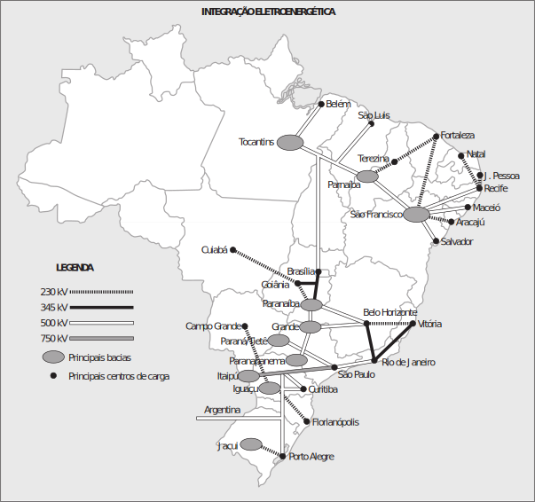
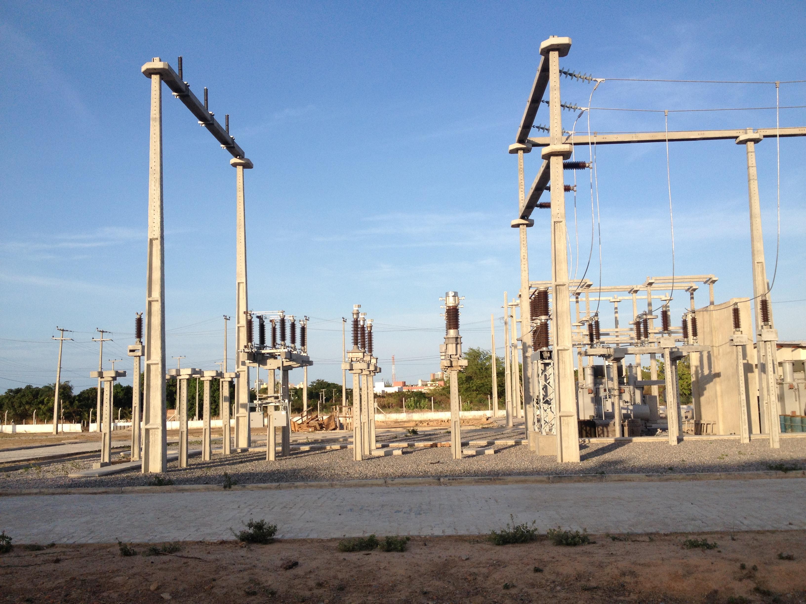
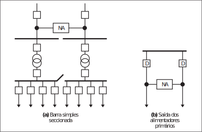

% Distribuição de Energia Elétrica
% Aula 01: Introdução
% Professor Lucas Melo - Abril de 2017

# <!-- Comment -->

## Sistema Elétrico de Potência
- **Geração**: Perfaz a função de converter alguma forma de energia em
energia elétrica.
- **Transmissão**: É responsável pelo transporte da energia elétrica dos centros de produção aos de consumo.
- **Distribuição**: Distribui a energia elétrica recebida do sistema de
transmissão aos grandes, médios e pequenos consumidores.

## Sistema Elétrico de Potência

{ width=10in }

## Sistema Elétrico de Potência

{ width=10in }

# Geração

- Hidrelétrica;
- Termelétrica.

# Transmissão

- Sistema Interligado Nacional;
- Linhas de transmissão tanto em CA quanto em CC.

# Bacias Hidrográficas e SIN

{ width=6in }

# Distribuição

- Subtransmissão

> Este elo tem a função de captar a energia em grosso das subestações de subtransmissão e transferi-la às SEs de distribuição e aos consumidores, em tensão de subtransmissão, através de linhas trifásicas operando em tensões, usualmente, de 138 kV ou 69 kV ou, mais raramente, em 34,5 kV.

# Arranjos de Rede de Subtransmissão

{ width=6in }

#

## Subestações de distribuição 

As subestações de distribuição, SEs, que são supridas pela rede de subtransmissão, são responsáveis pela transformação da tensão de subtransmissão para a de distribuição primária.

## Subestações de Distribuição

Principais componentes:

- Transformadores de potência (69/13,8kV);
- Disjuntores;
- Religadores;
- Chaves seccionadoras;
- Lâmina de terra;
- Transformadores de Corrente;

## Subestações de Distribuição

- Transformadores de Potencial;
- Isoladores;
- Para-raios;
- Condutores;
- Sistema de Proteção.

## Subestações de distribuição

{ width=7in }

## Subestação de barramento simples

{ width=6in }

## Subestação de barramento simples seccionado

{ width=6in }

## Potência Instalada e Potência Firme

$$S_{instalada} = \sum_{i=1}^{n}S_{nom}(i)$$

$$S_{firme} = f_{sobrecarga} \cdot \sum_{i=1}^{n} S_{nom}(i) + S_{transferida}$$

## Potência Instalada e Potência Firme

A título de exemplo, seja uma SE com dois transformadores de 60 MVA, com fator de sobrecarga em contingência de 1,20. Nestas condições, sem transferência de carga para outras SEs, resulta para a potência firme $60 \times 1,2 = 72 MVA$. Ou seja, em condição normal de operação cada transformador operará com somente 36 MVA, que representa 60% da potência nominal.

## Subestação de barramento duplo

{ width=6in }